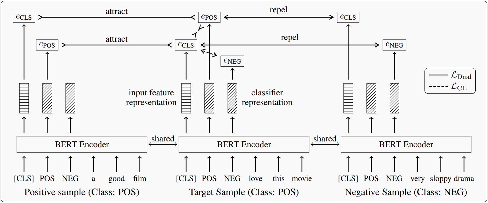

# Dual-Contrastive-Learning
 


A PyTorch implementation for our paper "Dual Contrastive Learning: Text Classification via Label-Aware Data Augmentation".

You can download the paper via: [[ArXiv]](https://arxiv.org/abs/2201.08702) [[PapersWithCode]](https://paperswithcode.com/paper/dual-contrastive-learning-text-classification).

## One-Sentence Summary

This paper proposes a novel contrastive learning framework for supervised classification tasks by simultaneously learning the features of input samples and the parameters of classifiers in the same space. 



## Abstract

Contrastive learning has achieved remarkable success in representation learning via self-supervision in unsupervised settings. However, effectively adapting contrastive learning to supervised learning tasks remains as a challenge in practice. In this work, we introduce a dual contrastive learning (DualCL) framework that simultaneously learns the features of input samples and the parameters of classifiers in the same space. Specifically, DualCL regards the parameters of the classifiers as augmented samples associating to different labels and then exploits the contrastive learning between the input samples and the augmented samples. Empirical studies on five benchmark text classification datasets and their low-resource version demonstrate the improvement in classification accuracy and confirm the capability of learning discriminative representations of DualCL.

## Requirement

- Python = 3.7
- torch = 1.11.0
- numpy = 1.17.2
- transformers = 4.19.2

## Preparation

### Clone

```bash
git clone https://github.com/hiyouga/Dual-Contrastive-Learning.git
```

### Create an anaconda environment:

```bash
conda create -n dualcl python=3.7
conda activate dualcl
pip install -r requirements.txt
```

## Usage

```sh
python main.py --method dualcl
```

## Citation

If this work is helpful, please cite as:

```bibtex
@article{chen2022dual,
  title={Dual Contrastive Learning: Text Classification via Label-Aware Data Augmentation},
  author={Qianben Chen and Richong Zhang and Yaowei Zheng and Yongyi Mao},
  journal={arXiv preprint},
  year={2022}
}
```

## Contact

hiyouga [AT] buaa [DOT] edu [DOT] cn

## License

MIT
